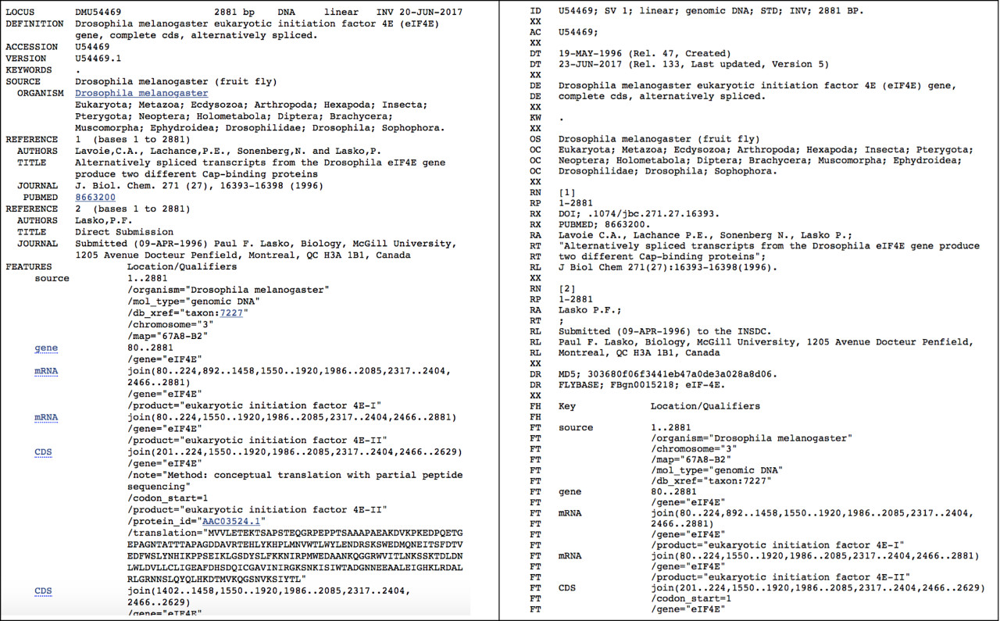

## FASTA

### Zadanie 1
Poniżej znajduje się sekwencja w formacie FASTA.

```
>NM_000207.2 Homo sapiens insulin (INS)
AGCCCTCCAGGACAGGCTGCATCAGAAGAGGCCATCAAGCAGATCACTGTCCTTCTGCCATGGCCCTGTG
GATGCGCCTCCTGCCCCTGCTGGCGCTGCTGGCCCTCTGGGGACCTGACCCAGCCGCAGCCTTTGTGAAC
CAACACCTGTGCGGCTCACACCTGGTGGAAGCTCTCTACCTAGTGTGCGGGGAACGAGGCTTCTTCTACA
CACCCAAGACCCGCCGGGAGGCAGAGGACCTGCAGGTGGGGCAGGTGGAGCTGGGCGGGGGCCCTGGTGC
AGGCAGCCTGCAGCCCTTGGCCCTGGAGGGGTCCCTGCAGAAGCGTGGCATTGTGGAACAATGCTGTACC
AGCATCTGCTCCCTCTACCAGCTGGAGAACTACTGCAACTAGACGCAGCCCGCAGGCAGCCCCACACCCG
CCGCCTCCTGCACCGAGAGAGATGGAATAAAGCCCTTGAACCAGCAAAA
```

1. Czy rekord dotyczy sekwencji DNA / RNA / białka?
2. Podaj identyfikator tej sekwencji.
3. Podaj opis tej sekwencji.


### Zadanie 2
Jakiej cząsteczki dotyczy poniższa sekwencja (DNA / RNA / białko)?

```
>myseq01
MALWMRLLPLLALLALWGPDPAAAFVNQHLCGSHLVEALYLVCGERGFFYTPKTRREAEDLQVGQVELGG
GPGAGSLQPLALEGSLQKRGIVEQCCTSICSLYQLENYCN
```


## GenBank

### Zadanie 3
W przeglądarce internetowej otwórz stronę serwisu [NCBI](https://www.ncbi.nlm.nih.gov). Z rozwijanej listy dostępnych baz danych `All databases` wybierz `Nucleotide`. W polu wyszukiwania wyszukaj rekord o numerze dostępu `NM_000207`.

1. Z jakiego organizmu pochodzi sekwencja zawarta w tym rekordzie?
2. Jaki jest typ cząsteczki tego rekordu (białko / sekwencja genomowa / transkrypt)?
3. Jakiej długości jest sekwencja zawarta w tym rekordzie?
4. W oparciu o pole `DEFINITION` napisz czym jest ta cząsteczka?
5. W ilu artykułach naukowych została opisana ta cząsteczka?
6. Na którym chromosomie znajduje się ten gen?
7. Podaj trzy synonimy tego genu.
8. Z ilu egzonów złożony jest ten gen?
9. Który egzon zawiera sekwencje kodującą białko (CDS)?
10. Jaka jest długość sekwencji CDS i białka?


### Zadanie 4
W serwisie NCBI w bazie `Protein` wyszukaj rekord o numerze dostępu `NP_000198`.

> Wskazówka: wyjaśnienie pól rekordów formatu GenBank <a target="_blank" href="http://www.ncbi.nlm.nih.gov/Sitemap/samplerecord.html">Sample GenBank Record</a>.

1. Podaj datę ostatniej modyfikacji tego rekordu.
2. Ile razy ten rekord był uaktualniany?
3. Z której bazy pochodzi rekord (`GenBank` czy `RefSeq`)? Uzasadnij swoją odpowiedź.
4. Do jakiego działu taksonomicznego `GenBank Division` zaklasyfikowany został ten rekord?

Wyświetl rekord w formacie FASTA i umieść go w protokole.


## EMBL/ENA

### Zadanie 5 
W bazie nukleotydowej NCBI wyszukaj rekord o numerze dostępu `U54469.1`. W nowej karcie przeglądarki internetowej otwórz bazę [ENA/EMBL](http://www.ebi.ac.uk/ena) i w polu wyszukiwania odszukaj ten sam rekord. Wyświetl rekord w wersji tekstowej `TEXT`.



1. Czy rekordy dotyczą sekwencji genomowej czy sekwencji transkryptu (mRNA)?
2. Czy oba rekordy różnią się pod względem: 
   * długości sekwencji
   * listy publikacji naukowych
   * pozycji na chromosomie?
3. Ile wariantów transkrypcyjnych (mRNA) może powstawać z tej sekwencji DNA?
4. Z ilu egzonów złożone są te warianty mRNA?
> Wróć do trybu graficznego rekordu bazy ENA.
5. Dlaczego trzem polom mRNA odpowiadają tylko dwa pola CDS?
6. Wymień dwa przykłady informacji, które znajdują się w jednym rekordzie, a których nie ma w drugim.
7. Wyświetl oba rekordy w formacie `FASTA`. Czy liczba znaków w linii sekwencji jest taka sama?

## UniProt

### Zadanie 6
W serwisie [UniProt](http://www.uniprot.org") wyszukaj rekord o numerze dostępu `ROA1_HUMAN`. Wyświetl rekord w formacie tekstowej (`Format`).

1. W jakim formacie zapisany jest ten rekord (GenBank / EMBL)?
2. Jaki jest to typ cząsteczki (białko / DNA / RNA)?
3. Z jakiej bazy danych serwisu UniProt pochodzi ten rekord?
4. Podaj długość sekwencji zawartej w tym rekordzie?
5. Wyświetl rekord w formacie FASTA i umieść go w protokole.


## XML

### Zadanie 7
Wyświetl rekord `ROA1_HUMAN` bazy UniProt w formacie XML.

1. Czym charakteryzuje się format XML?
2. Podaj jedną zaletę i wadę jaką według Ciebie ma format XML.


## Konwersja formatów

### Zadanie 8
Użyj programu <a target="_blank" href="https://www.ebi.ac.uk/Tools/sfc/emboss_seqret/">EMBOSS SeqRet</a> i zamień sekwencję z zadania 1 na format GenBank. Umieść wynik w protokole.


