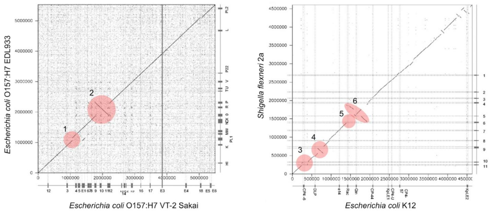
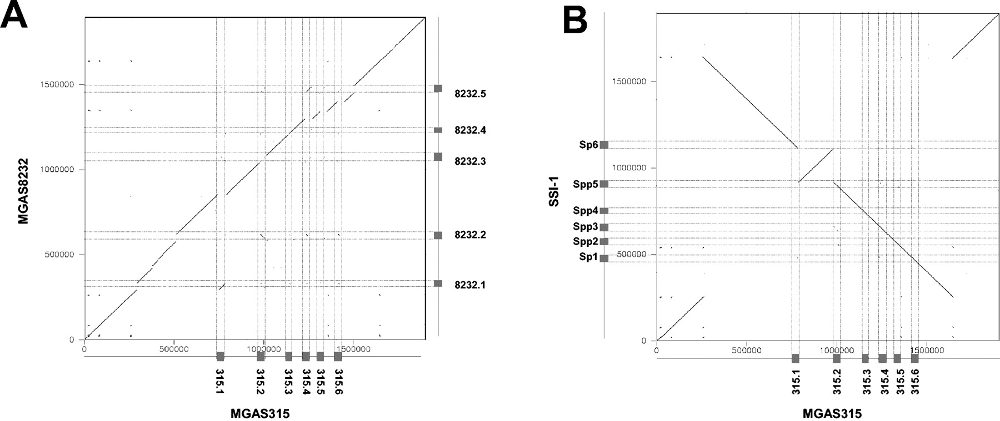

## DotPlot

### Zadanie 1
Poniżej znajdują się sekwencje nukleotydowe. Korzystając z programu `dotmatcher` z pakietu [EMBOSS](http://emboss.bioinformatics.nl/cgi-bin/emboss/dotmatcher/) wykonaj analizy dotplot następujących par sekwencji (parametry: wielkość okna *Window size* 15, wartość graniczna *Threshold* 50):

A. s1:s1

B. s1:s7

C. s2:s2

D. s3:s4

E. s5:s6

F. s3:s3

Umieść wyniki analiz w protokole wraz z ich interpretacją. 

```
>s1
caaggtgcatgttttcttcacgaagtcagagaccgttcagcaaagcagggactagagcgc
ttgcaagagatacttctttctgagatcctcgttgtaaaaaaaactaaggatcaatgattc
atttgaaggaactaatatgcaaaacaaacactacagtacaaaaaggttcttcttgttctg
gatgatgttgatcacatagatcagttaaatgcattagccggggagcgtgaatggtttggt
gatggaagtagaatcatcataacaaccaaaagataaacacttgcttgttaagtaaggaac

>s2
caaggtgcatgttttcttcacgaagtcagagaccgttcagcaaagcagggactagagcgc
ttgcaagagatacttctttctgagatcctcgttgtaaaaaaaactaaggatcaatgattc
atttgaaggaactaatatgcaaaacaaacactacagtacaaaaaggttcttcttgttctg
gatgatgttgatcacatagatacttctttctgagatcctcgttgtaaaaaaaactaagga
gatggaagtagaatcatcataacaaccaaaagataaacacttgcttgttaagtaaggaac

>s3
caaggtgcatgttttcttcacgaagtcagagaccgttcagcaaagcagggactagagcgc
ttgcaagagaatatatatatatatatatatatatatataaaaactaaggatcaatgattc
atttgaaggaactaatatgcaaaacaaacactacagtacaaaaaggttcttcttgttctg
gatgatgttgtcacgctccccggctaatgcatttaactgatctatgtgatatggtttggt
gatggaagtagaatcatcataacaaccaaaagataaacacttgcttgttaagtaaggaac

>s4
gttctaaccactactcgtcttgaaaaggttggatcaattatgggaacattgcaaccatat
gaattgtcaaatttgtctcaagaagattgttggttgttgttcatgcaacgtgcatttggg
caccaagaagaaataaatcttaatcttgtggctatcggaaaggagattgtgaaaaaatgt
ggtggtgtgcctctagcagcatatatatatatatatatatatatatataagagagaagaa
agacagtgggaacatgtgagagatagtgagatttggaaattgcctcaagaagaaagttct

>s5
caaggtgcatgttttcttcacgaagtcagagaccgttcagcaaagcagggactagagcgc
ttgcaagagatacttctttctgagatcctcgttgtaaaaaaaactaaggatcaatgattc
atttgaaggaactaatatgcaaaacaaacactacagtacaaaaaggttcttcttgttctg
gatgatgttgatcacatagaatggtttggtgatggaagtagaatcatcataacaaccaaa
agataaacacttgcttgttaagtaaggaac

>s6
caaggtgcatgttttcttcacgaagtcagagaccgttcagcaaagcagggactagagcgc
ttgcaagagatacttctttctgagatcctcgttgtaaaaaaaactaaggatcaatgattc
atttgaaggaactaatatgcaaaacaaacactacagtacaaaaaggttcttcttgttctg
gatgatgttgatcacatagatcagttaaatgcattagccggggagcgtgaatggtttggt
gatggaagtagaatcatcataacaaccaaa

>s7
caaggtgcatgttttcttcacgaagtcagaggaccagcgacaaagcagggactagagcgc
ttgcaagagatacttctttctgagatcctcgttgtaaaaaaaactaaggatcaatgattc
cggccagtacgcagaggacgttatcaaacactacagtacaaaaaggttctaggagcgagt
gatgatgttgatcacatagatcagttaaatcgatgaacgtccggagcagaatggtttggt
gatggaagtagaatcatcataacaaccaaaagataaacacttgcttgttaagtaaggaac

```


### Zadanie 2
W pliku [arabidopsis.md](./arabidopsis.md) znajdują się dwie sekwencje nukleotydowe jednego z genów *Arabidopsis thaliana*. Korzystając z programu `dotmatcher` wykonaj analizę dotplot tych sekwencji (wynik analizy umieść w protokole). 

> Wskazówka: Pierwsza sekwencja to sekwencja genomowa, a druga sekwencja to mRNA. 

> Wskazówka: Najkrótszy egzon ma długość 72 pz. 

1. Z ilu egzonów składa się ten gen?

 
### Zadanie 3
W bazie `Protein` NCBI, korzystając z zaawansowanego wyszukiwania `Advanced` skonstruuj tak zapytanie aby wyszukać wszystkie rekordy dotyczące białka `“ERK kinase”` i `“MAP kinase”`. 

1. Jak brzmiało Twoje zapytanie (`Search details`)?

Przy pomocy filtrów ogranicz wyniki wyszukiwania do sekwencji o długości 350 - 360 aminokwasów, pochodzących z bazy RefSeq i z *Arabidopsis thaliana*. Następnie, posortuj wyniki po numerze dostępu (`Sort by Accession`) i otwórz ostatni rekord. 

2. Podaj numer dostępu rekordu. 
3. Podaj pozycję domeny katalitycznej. 

Przejdź do bazy `Gene`.

4. Podaj identyfikator tego genu.

Zapisz do plików FASTA sekwencję genomową (`NC_003075.7`) oraz sekwencję mRNA (`NM_118740.3`). Korzystając z programu `dotmatcher` wykonaj analizę dotplot tych sekwencji (wyniki analizy umieść w protokole), stosując następujące zestawy parametrów *window size* : *threshold*

A. 10:20

B. 10:30

C. 10:40

D. 30:10

E. 30:40

F. 30:70

5. Jak zmiana parametrów wielkość okna (*Window size*) i wartość graniczna (*Threshold*) wpływa na końcowy wynik analizy?
6. Co można powiedzieć o strukturze tego genu?


### Zadanie 4
W artykule *Phages and the evolution of bacterial pathogens: from genomic rearrangements to lysogenic conversion* (DOI: 10.1128/MMBR.68.3.560-602.2004) analizowano wpływ fagów na rearanżacje w genomach bakteryjnych.

1. Poniższa rycina przedstawia wyniki dwóch analiz dotplot dwóch szczepów *Escherichia Coli* (lewy panel) oraz *Escherichia coli* i *Shigella flexneri* (prawy panel). Zinterpretuj zaznaczone fragmenty wykresów (1-6).



2. Poniższa rycina przedstawia przyrównanie genomów dwóch szczepów *Streptococcus pyogenes* należących do różnych serotypów i związanych z różnymi jednostkami chorobowymi. Na wykresach dotplot zanaczono regiony pochodzące od profagów. Scharakteryzuj oba wykresy w zakresie sekwencji profagów. 




## Water/Needle

### Zadanie 5
Poniżej znajduje się przyrównanie sekwencji X i Y. 

```
X: GGAATGG
Y: ---ATG-
```

Oblicz wartość punktacji tego przyrównania (*score*) stosując następujący system punktacji: elementy zgodne (*match*) = 2, elementy niezgodne (*mismatch*) = -1 oraz przerwa (*gap*) = -2. 

### Zadanie 6
Korzystając z programów [needle](https://www.ebi.ac.uk/Tools/psa/) i [water](https://www.ebi.ac.uk/Tools/psa/) wykonaj przyrównania sekwencji z zadania 4 (parametry domyślne). Wykonane przyrównania umieść w protokole. 

1. Czym różnią się oba przyrównania?
2. Ile wynosi procent identyczności dla przyrównania lokalnego i globalnego?
3. Jaka jest wartość punktacji (*score*) obu przyrównań?


### Zadanie 7
Poniżej znajduje się sekwencja syntetazy adenylobursztynianowej z *Escherichia Coli* i *Bacillus subtilis*. 

```
>seq_ecoli
MSLSSLTLDSNPRFAVGGPYHQEVDGLRESELAKSFIGTTKRGIGPAYSSKVIRNGIRVGDLRHMDLPQKLDLLL
>seq_bsubtilis
VALDNAREKARGAKAIGTTGRGIGPAYEDKVARRGLRVGDLFDKETLPQKLDLLLSDAAARFQGFKYTP
```

Wykonaj przyrównanie globalne (`needle`) i lokalne (`water`) sekwencji (wynik umieść w protokole).

1. Czy białka zachowane są na całej długości?
2. Wykonaj ponownie przyrównanie lokalne zmniejszając kary za stosowanie przerw - otwarcie przerwy (*gap open*) = 1 i wydłużenie przerwy (*gap extend*) = 0.001. W jaki sposób zmniejszenie kar za stosowanie przerw wpłynęło na to przyrównanie?
3. Wykonaj ponownie przyrównanie lokalne zwiększając kary za stosowanie przerw - otwarcie przerwy (*gap open*) = 50 i wydłużenie przerwy (*gap extend*) = 5. W jaki sposób zwiększenie kar za stosowanie przerw wpłynęło na to przyrównanie?


### Zadanie 8
W bazie UniProt wyszukaj rekord syntetazy S-adenozylometioniny człowieka (`P31153`), *Escherichia Coli* (`P0A817`) oraz *Citrobacter koseri* (`A8APG1`). Wyświetl wszytskie rekordy w formacie FASTA. Wykorzystując program `needle` wykonaj przyrównanie następujących par sekwencji: 

A. *Escherichia Coli* : *Citrobacter koseri*

B. *Escherichia Coli* :  człowiek

1. Które przyrównanie odznacza się wyższym poziomem podobieństwa sekwencji i ile wynosi?
2. Czy wynik przyrównań jest zgodny z Twoimi oczekiwaniami na temat mutacji sekwencji?
3. Który fragment sekwencji jest najprawdopodbniej kluczowy do działania tego enzymu?


### Zadanie 9
Korzystając z programu `needle` wykonaj przyrównanie nastepujących par sekwencji: 

A. s15:s16

B. s17:s18

C. s19:s20

Którym wykresom dotplot (z zadania 1) odpowiadają te dopasowania?

```
>s15
caaggtgcatgttttcttcacgaagtcagagaccgttcagcaaagcagggactagagcgc
ttgcaagagatacttctttctgagatcctcgttgtaaaaaaaactaaggatcaatgattc
atttgaaggaactaatatgcaaaacaaacactacagtacaaaaaggttcttcttgttctg
gatgatgttgatcacatagaatggtttggtgatggaagtagaatcatcataacaaccaaa
agataaacacttgcttgttaagtaaggaac

>s16
caaggtgcatgttttcttcacgaagtcagagaccgttcagcaaagcagggactagagcgc
ttgcaagagatacttctttctgagatcctcgttgtaaaaaaaactaaggatcaatgattc
atttgaaggaactaatatgcaaaacaaacactacagtacaaaaaggttcttcttgttctg
gatgatgttgatcacatagatcagttaaatgcattagccggggagcgtgaatggtttggt
gatggaagtagaatcatcataacaaccaaa

>s17
caaggtgcatgttttcttcacgaagtcagagaccgttcagcaaagcagggactagagcgc
ttgcaagagatacttctttctgagatcctcgttgtaaaaaaaactaaggatcaatgattc
atttgaaggaactaatatgcaaaacaaacactacagtacaaaaaggttcttcttgttctg
gatgatgttgatcacatagatcagttaaatgcattagccggggagcgtgaatggtttggt
gatggaagtagaatcatcataacaaccaaaagataaacacttgcttgttaagtaaggaac

>s18
caaggtgcatgttttcttcacgaagtcagagaccgttcagcaaagcagggactagagcgc
ttgcaagagatacttctttctgagatcctcgttgtaaaaaaaactaaggatcaatgattc
atttgaaggaactaatatgcaaaacaaacactacagtacaaaaaggttcttcttgttctg
gatgatgttgatcacatagatcagttaaatgcattagccggggagcgtgaatggtttggt
gatggaagtagaatcatcataacaaccaaaagataaacacttgcttgttaagtaaggaac

>s19
caaggtgcatgttttcttcacgaagtcagagaccgttcagcaaagcagggactagagcgc
ttgcaagagatacttctttctgagatcctcgttgtaaaaaaaactaaggatcaatgattc
atttgaaggaactaatatgcaaaacaaacactacagtacaaaaaggttcttcttgttctg
gatgatgttgatcacatagatcagttaaatgcattagccggggagcgtgaatggtttggt
gatggaagtagaatcatcataacaaccaaaagataaacacttgcttgttaagtaaggaac

>s20
caaggtgcatgttttcttcacgaagtcagaggaccagcgacaaagcagggactagagcgc
ttgcaagagatacttctttctgagatcctcgttgtaaaaaaaactaaggatcaatgattc
cggccagtacgcagaggacgttatcaaacactacagtacaaaaaggttctaggagcgagt
gatgatgttgatcacatagatcagttaaatcgatgaacgtccggagcagaatggtttggt
gatggaagtagaatcatcataacaaccaaaagataaacacttgcttgttaagtaaggaac
```


